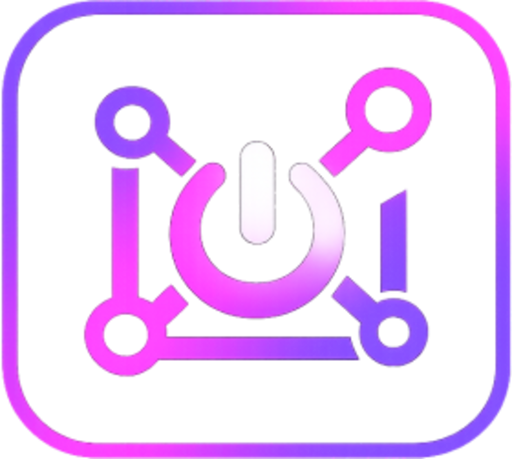

<div align="center">



# LightNode

**The friction-free way to run a LightChain AI worker.**

[](https://github.com/marinom2/lightnode/actions/workflows/ci.yml)
[](https://github.com/marinom2/lightnode/releases/latest)
[](LICENSE)
[](https://lightchain.ai)

</div>

Connect a wallet, check your machine, install in one click, and manage the whole
lifecycle - earnings, payouts, and exit - without ever touching a terminal.

LightNode is the complete, no-terminal way to run a LightChain AI worker - it handles
everything an operator needs, end to end:

- **Real machine readiness** - native CPU/RAM/GPU/VRAM detection, a capacity score,
  and a **Speed test** that runs an actual inference and projects it against the live
  on-chain job deadline, so you see slash risk before you stake.
- **One-click, wallet-funded install** - generates and secures the worker key,
  funds + stakes from your connected wallet, registers on-chain, and brings the
  worker online, with a clean live progress view instead of a terminal dump.
- **Stays online for you** - a keep-online watchdog auto-starts Docker and the
  worker and keeps the model warm (no cold-load timeouts). On a Linux server it just
  runs 24/7; it survives reboots and respects an intentional Stop. (On a laptop, keep
  it plugged in with the lid open - on battery or with the lid closed the OS sleeps
  and the worker pauses until the machine wakes.)
- **Multi-model serving** with a memory-fit gate, and live add-a-model.
- **Safe, non-custodial signing** - the on-disk keystore is the source of truth,
  keys are isolated per network, and the app refuses to sign one network's action
  with another's key.
- **Full lifecycle, no terminal** - live earnings (settled vs pending-release),
  settle/claim, deregister, gas-aware withdraw, free-up-memory, and replaced-key
  recovery so a staked worker is never lost - plus a real-time **Live health** panel
  (heartbeat, in-flight jobs, model warm/cold) the on-chain subgraph can't see.

It reads live network and worker state from the LightChain workers subgraph, and runs
as both a web app and a native desktop app from one codebase. Running a worker is the
first flow - validator onboarding and multi-worker fleets are next (see
[Roadmap](#scope-and-roadmap)).

- **Web app:** <https://lightnode.app> - browse the network, score your
  machine, and copy ready-to-run setup commands.
- **Desktop app:** the same UI in a native shell that can run those commands for
  you (one-click install, status, settle, deregister, withdraw). Download from
  the [Releases](https://github.com/marinom2/lightnode/releases) page.

---

## Contents
- [Who this is for](#who-this-is-for)
- [Two ways to run it](#two-ways-to-run-it)
- [Quick start (operators)](#quick-start-operators)
- [The worker lifecycle](#the-worker-lifecycle)
- [Operations reference](#operations-reference)
- [How earnings and withdrawals work](#how-earnings-and-withdrawals-work)
- [Networks](#networks)
- [Platform support](#platform-support-tested-status)
- [Architecture](#architecture)
- [Security and key handling](#security-and-key-handling)
- [For developers](#for-developers)
- [Scope and roadmap](#scope-and-roadmap)

---

## Who this is for

Anyone who wants to contribute GPU/CPU time to LightChain's decentralized AI
inference network and earn LCAI for completed jobs. A worker:

- serves one or more open models (default `llama3-8b`) through a local Docker
  container, as long as the machine can keep them all in memory at once,
- is identified on-chain by a generated worker key with a staked deposit,
- gets paid a share of each job's fee once the job is released.

You do not need to be a developer. The desktop app handles install, keep-alive,
payouts, and exit; the web app gives you the same guidance as copy-paste commands
if you prefer to run them yourself.

## Two ways to run it

| | Web app | Desktop app |
|---|---|---|
| Browse network, score machine, run the Speed test | Yes | Yes |
| Tailored per-OS setup | Yes (copy commands) | Yes (one click) |
| Run install / status / settle / deregister / withdraw for you | No (copy-run in your own terminal) | Yes (native, streamed log) |
| Reads the worker key from your machine to sign payouts | No | Yes (locally, never leaves the device) |

The desktop app **loads the hosted web UI** and adds a small native bridge for the
actions that need local machine access (Docker, the keystore, signing). That means
most updates ship to the desktop app the moment the web app is deployed - no new
download required (see [Architecture](#architecture)).

## Quick start (operators)

**Requirements:** Docker, an Ollama-capable machine (a 16 GB+ unified-memory Mac
or a discrete 8 GB+ GPU is comfortable for `llama3-8b`), and enough LCAI to stake
(see [Networks](#networks)).

1. **Get the app.** Download the desktop build for your OS from
   [Releases](https://github.com/marinom2/lightnode/releases), or open
   <https://lightnode.app> in a browser.
2. **Connect a wallet.** This is only used to read your address and fund the
   worker; it never signs worker payouts.
3. **Check your machine.** The onboarding wizard scores your hardware against the
   model you pick and runs a real **Speed test** - an actual local inference timed
   against the on-chain job deadline, so you can see slash risk before you stake.
4. **Install.** Pick a network and model, fund the generated worker address, and
   click install. The app sets up Docker, Ollama, the keystore, registration, and
   a keep-online watchdog.
5. **Earn.** The worker picks up jobs automatically. Watch status and earnings on
   the dashboard.

When you are done, use **Settle earnings**, **Deregister**, **Withdraw Funds**, and
optionally **Free up memory** - all from the Operations panel.

## The worker lifecycle

```
install --> run (keep-online) --> settle earnings --> deregister --> withdraw --> free up memory
```

| Stage | What it does |
|---|---|
| install | stake + register the worker |
| run | serves jobs, auto-restarts, keeps the model warm |
| settle earnings | release jobs + claim rewards into the worker wallet |
| deregister | returns the staked LCAI to the worker wallet |
| withdraw | moves the wallet's LCAI to your own wallet |
| free up memory | stops the worker and reclaims RAM (optional cleanup) |

The most important and least obvious part is **how a job becomes spendable LCAI** -
see [How earnings and withdrawals work](#how-earnings-and-withdrawals-work). The
full operator journey, including switching networks or models on one machine, is
documented in [docs/WORKER_LIFECYCLE.md](docs/WORKER_LIFECYCLE.md).

## Operations reference

The dashboard's Operations panel is the worker's control surface. On desktop each
tile runs natively and streams its log; on web each tile gives you the exact
command to copy.

| Tile | What it does |
|---|---|
| **Status** | Local container health plus the most recent log lines. |
| **Restart** | Recovers a stalled worker, pre-warms the model (so the first job doesn't cold-load), and re-arms the keep-online watchdog. |
| **Stop** | Pauses the worker (keeps Docker + the model loaded for a fast restart). Stake stays intact. |
| **Tail jobs** | Live-follows the worker's job log. |
| **Speed test** | Runs a real local inference and projects the worst-case job time against the on-chain deadline, so you can see slash risk before it bites. |
| **Settle earnings** | Releases your completed jobs and **claims** the resulting rewards into the worker wallet. |
| **Deregister** | Settles + claims first, then exits the network and returns your stake to the worker wallet. Stops the container so you can install another network. |
| **Free up memory** | Gives your machine its RAM back: stops the worker, unloads the model from Ollama, and quits Docker. A worker pins its model (~5 GB) plus a Docker VM even when stopped, so this is the "I want my machine back" button. Stake + registration are untouched - Restart brings it back. |
| **Withdraw Funds** | Sends the worker wallet's spendable LCAI to any address you choose. Signs locally with the worker key (in-browser if the app holds it, otherwise derived from the on-disk keystore). |
| **Models this worker serves** | Add a model to the served set live (add-only): it updates the on-chain set (no re-stake) and restarts the worker with the new set, enforcing the same memory check as setup. Removing a model isn't safe while registered (the gateway could still route its jobs), so dropping one means deregister + reinstall with the smaller set. |
| **Recover a replaced key** | Lists worker keys you replaced (archived on this device when you generate a new one), flags any still holding a stake on-chain, and restores one as your active worker. So a staked worker is never lost. |

On the desktop app, your own worker also shows a **Live health** panel - a real-time
read of the worker on your machine (heartbeat, whether a job is being processed
right now, the served model's warm/cold state, releases) that the on-chain data
can't see. And while the worker is meant to be online, the app **keeps your machine
awake** (so it can't sleep mid-job and drop it); it lets the machine sleep again
once you Stop, Free up memory, or Deregister.

## How earnings and withdrawals work

This trips people up, so it is worth stating plainly. A completed job's reward does
**not** land directly in your worker wallet. It moves through three places:

1. **Job released.** When a completed job's dispute window passes, `releaseJob`
   credits your share into an **internal balance inside the JobRegistry contract**.
   This is what the subgraph reports as your earnings.
2. **Earnings claimed.** Calling `withdraw()` on the JobRegistry moves that internal
   balance into your **worker wallet** as spendable LCAI. **Settle earnings** does
   the release and the claim together, so after settling, your worker wallet
   reflects the rewards.
3. **Funds withdrawn.** **Withdraw Funds** sends the worker wallet's balance to a
   wallet you control.

Your **stake** is separate. It stays locked while you are registered and returns to
the worker wallet only when you **Deregister**. So a typical end-of-life balance is
`stake + leftover gas + claimed earnings`, all of which you then move out with
Withdraw Funds.

More detail, including the on-chain selectors and a worked example, is in
[docs/WORKER_LIFECYCLE.md](docs/WORKER_LIFECYCLE.md).

## Networks

LightNode supports both LightChain AI networks, switchable from the toggle in the UI.
**One worker runs per machine at a time** (a single worker container), so testnet and
mainnet are run sequentially on one box; running both at once needs separate machines.
Keys are isolated per network, though: each network's keystore lives in its own
directory (`~/lightchain-worker/keys-<network>`), so a mainnet operator can install
and test on testnet without touching or risking their mainnet key. Switching back to
mainnet reuses the saved mainnet key.

| | Testnet | Mainnet |
|---|---|---|
| Chain ID | 8200 | 9200 |
| RPC | `https://rpc.testnet.lightchain.ai` | `https://rpc.mainnet.lightchain.ai` |
| Explorer | `https://testnet.lightscan.app` | `https://mainnet.lightscan.app` |
| Minimum stake | 5,000 LCAI | 50,000 LCAI |
| Faucet | `https://lightfaucet.ai` | n/a |

Worker identities are per-network and independent: your testnet worker and your
mainnet worker are different addresses with different keys, stakes, and earnings.

## Platform support (tested status)

Being honest about what has actually been run on real hardware:

| OS | Status |
|---|---|
| **macOS** (Apple Silicon) | **Tested end-to-end** - install, run, all operations, settle, withdraw, deregister, and live payouts on both testnet and mainnet. |
| **Linux** | Installers build in CI and the generated commands are syntax-validated, but the full worker flow has **not yet been verified on real Linux hardware**. |
| **Windows** | Installers build in CI and the PowerShell is parse-checked, but the full worker flow has **not yet been verified on a real Windows machine**. |

So macOS is the proven path today. Linux and Windows are wired up and expected to
work, but they need a real run-through - **community testing and bug reports for
those two are very welcome** (open an issue with your OS, what you did, and the log).

## Architecture

- **Frontend:** Next.js 15 (App Router), React 19, Tailwind CSS v4. Wallet via
  Reown AppKit (wagmi + viem). Live network data comes from the LightChain workers
  subgraph, proxied through server-side `/api/*` routes (no client CORS, short CDN
  cache).
- **Desktop:** a Tauri v2 shell that loads the **hosted** web UI and exposes a few
  native commands over IPC - run a streamed shell command, detect hardware, manage
  OS-keychain secrets, generate a worker key. Because it loads the hosted UI, a
  `vercel --prod` deploy reaches the desktop app on its next launch; only changes to
  the Rust layer / `tauri.conf` / capabilities need a new tagged release.
- **The on-disk keystore + worker container are the source of truth.** For any
  on-chain worker action (settle, deregister, withdraw), the signing key is derived
  from the keystore the worker actually runs with, using the container's keystore
  password, and the derived address is verified against the worker being targeted.
  This is why payouts work even if the app's cached key drifts, and why the app
  refuses to sign one network's action with another network's worker key.

A deeper write-up is in [docs/ARCHITECTURE.md](docs/ARCHITECTURE.md), and the UI /
design language (including the LightChain-derived look and a screen-by-screen
walkthrough) is in [docs/UI_AND_DESIGN.md](docs/UI_AND_DESIGN.md).

## Security and key handling

LightNode is **non-custodial**. No private key is ever sent to any LightNode server.

- The **worker key** is generated locally, stored in the OS keychain (with a
  localStorage fallback on unsigned builds), and written to the toolkit's keystore
  on disk. All worker payout transactions are signed locally on your machine.
- The **funding wallet** connects only to read its address and send LCAI to the
  worker; it never signs worker operations.
- The app reads only public, on-chain-derived data from the subgraph. Watchlists
  and preferences live in your browser's local storage.

Full details and how to report a vulnerability: [SECURITY.md](SECURITY.md).

## For developers

### Stack
Next.js 15 · React 19 · Tailwind v4 · wagmi + viem · Reown AppKit · Tauri v2 ·
Vitest · Playwright.

### Run the web app
```bash
npm install
cp .env.example .env.local   # add NEXT_PUBLIC_WALLETCONNECT_PROJECT_ID
npm run dev                  # http://localhost:3000
```

### Quality gate (matches CI)
```bash
npm run lint        # ESLint (next/core-web-vitals)
npm run typecheck   # tsc --noEmit
npm test            # Vitest unit tests (scriptgen, hardware, subgraph, utils)
npm run build       # production build
npm run test:e2e    # Playwright smoke tests
```
GitHub Actions runs the full gate on every push and PR.

### Project layout
```
app/            Routes: landing, /onboard wizard, /dashboard, /guide, /recover,
                /network, /worker/[address], and the /api/* subgraph proxy
components/     UI, including onboard/ (wizard steps) and the Operations + Withdraw panels
lib/            network constants, subgraph client, hardware scoring, secrets, the
                install-log cleaner, and scriptgen.ts - the single source for every
                generated shell command
desktop/        Tauri v2 shell (src-tauri: Rust commands, capabilities, build config)
tests/unit/     Vitest    tests/e2e/  Playwright
docs/           Architecture, worker lifecycle, UI/design, and release docs
```

### Documentation
- [docs/WORKER_LIFECYCLE.md](docs/WORKER_LIFECYCLE.md) - the operator's manual:
  install, earning, settling, withdrawing, deregistering, switching network/model.
- [docs/ARCHITECTURE.md](docs/ARCHITECTURE.md) - how the web + desktop apps fit
  together, the keystore-as-source-of-truth, staying online + sleep prevention.
- [docs/UI_AND_DESIGN.md](docs/UI_AND_DESIGN.md) - the design language (LightChain
  look) and a screen-by-screen UI walkthrough (model picker, withdraw, etc.).
- [SECURITY.md](SECURITY.md) - the key/privacy model · [DEPLOY.md](DEPLOY.md) - web
  deploy · [docs/RELEASING.md](docs/RELEASING.md) - desktop releases ·
  [CONTRIBUTING.md](CONTRIBUTING.md).

The most important module is [`lib/scriptgen.ts`](lib/scriptgen.ts): every command
the app runs or tells you to copy is generated there, so behavior is testable and
consistent across web and desktop. Pure logic in `lib/` is covered by Vitest.

### Deploying the web app
See [DEPLOY.md](DEPLOY.md). It is a standard Next.js app on Vercel; the only required
config is the WalletConnect project id and its origin allowlist.

### Building and releasing the desktop app
See [docs/RELEASING.md](docs/RELEASING.md). A tagged `v*` release builds macOS,
Linux, and Windows installers via GitHub Actions.

### Contributing
See [CONTRIBUTING.md](CONTRIBUTING.md). TypeScript with no `any`, pure logic in `lib/`
with a matching test, design tokens over hardcoded colors, and conventional commits.

## Scope and roadmap

Today LightNode is a complete, proven **worker** product - the full one-flow,
no-terminal experience from machine check to earning and exit. The same model is
built to extend across the rest of running LightChain infrastructure:

- **Validator onboarding** - the heavier, capital-gated path (full-node sync, a
  validator client, a larger deposit, monitoring and backups) brought into the same
  guided install -> manage -> earn flow, so securing the chain at the consensus layer
  is as approachable as running a worker.
- **Multi-worker fleets** - run and manage several workers (their own containers,
  keystores, and stakes) on one powerful machine; the model today is one worker per
  machine.
- **Deeper operations** - richer earnings analytics, proactive alerting, and
  automated recovery, building on the live health monitoring and on-chain
  reconciliation the app already does.

Worker onboarding is what ships and is battle-tested today; the rest is the direction
it's heading.

---

*LightNode is an independent, community-built tool for the LightChain AI ecosystem. It
is not affiliated with or endorsed by the LightChain AI team. Review the
official [`lightchain-worker-toolkit`](https://github.com/lightchain-protocol/lightchain-worker-toolkit)
for the worker runtime's own security and operational model.*

## License

MIT - see [LICENSE](LICENSE). Copyright (c) 2026 **KykyRykyPaloma**.

You're free to use, modify, and distribute LightNode, including commercially, as
long as you keep the copyright notice and license text. In plain terms: build on
it, but credit stays with the author.
