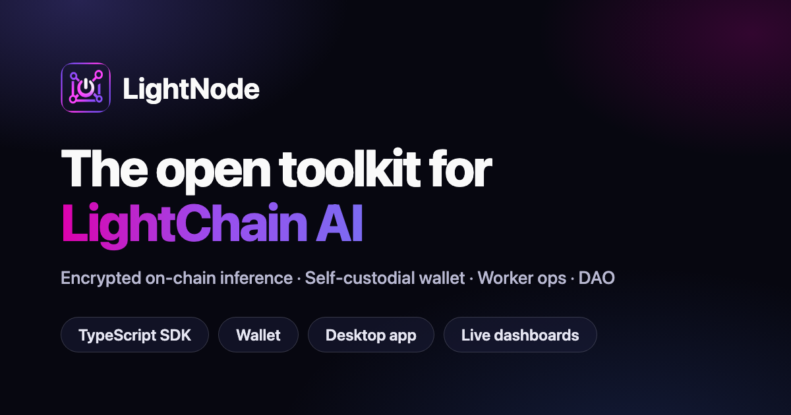
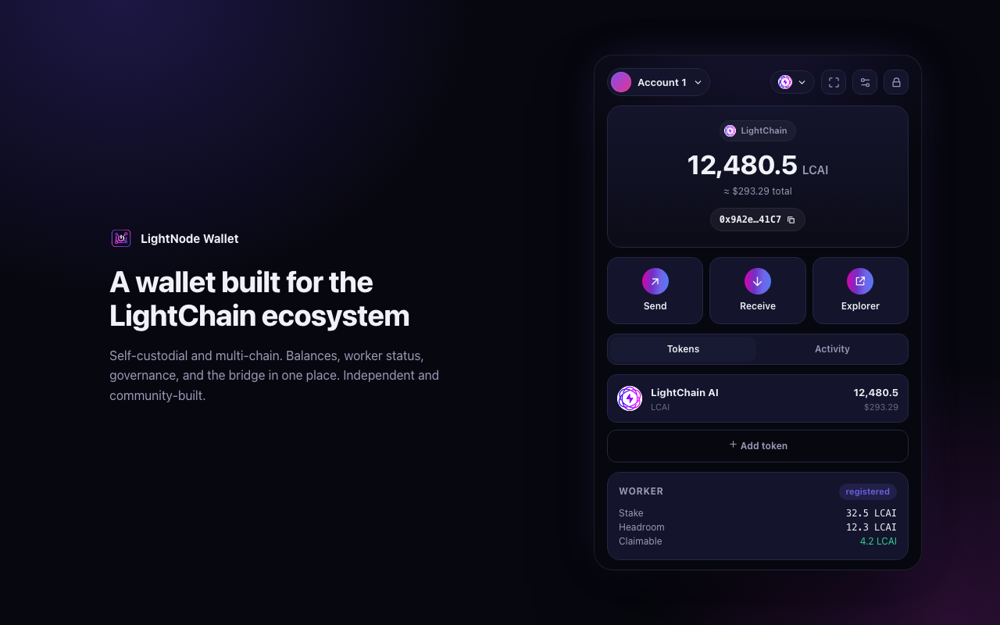
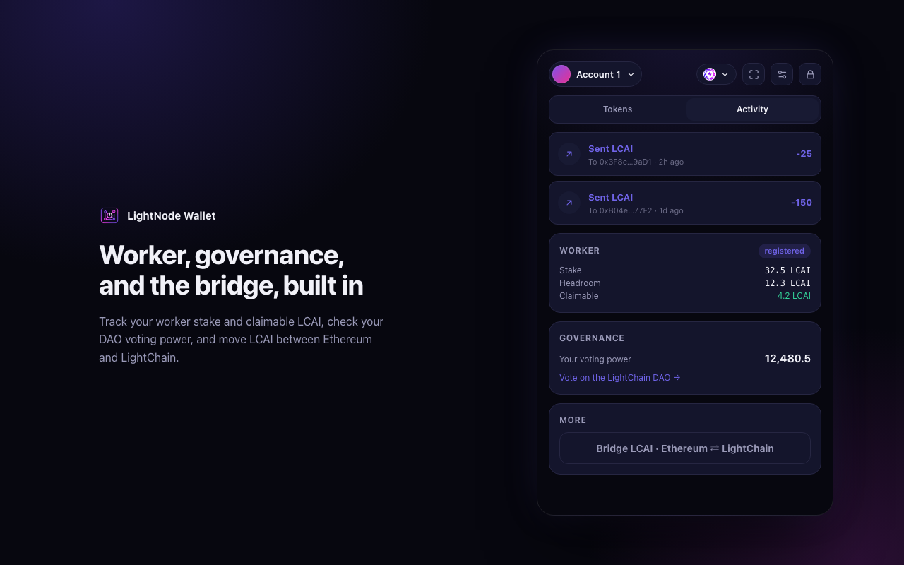
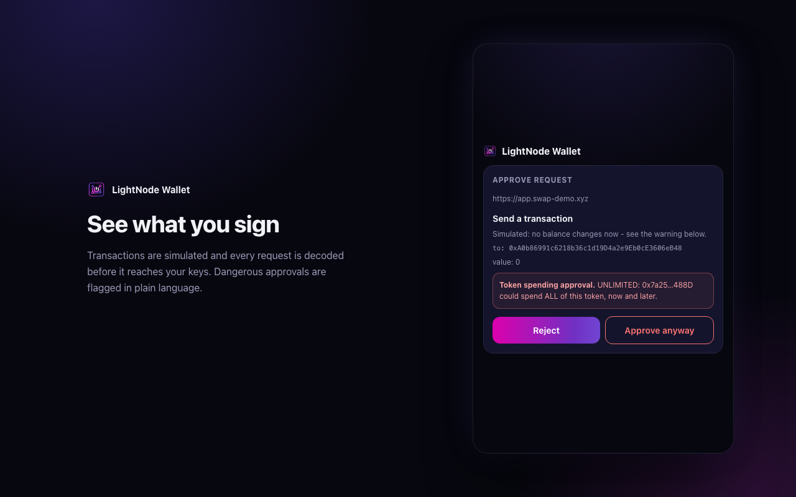

<div align="center">



# LightNode

**The open toolkit for LightChain AI.**

Encrypted on-chain inference from five lines of TypeScript. A self-custodial
wallet with an AI chat built in. A desktop app that turns your machine into a
paid worker in one flow. Live dashboards over the whole network. One repo,
independent and community-built.

[](https://github.com/marinom2/lightnode/actions/workflows/ci.yml)
[](https://www.npmjs.com/package/lightnode-sdk)
[](https://www.npmjs.com/package/create-lightnode-app)
[](LICENSE)
[](https://lightchain.ai)

[**Try the playground**](https://lightnode.app/playground) ·
[**Get the wallet**](https://lightnode.app/wallet) ·
[**Run a worker**](https://lightnode.app/onboard) ·
[**Docs**](https://lightnode.app/build)

</div>

## Never done this before? Start here

If you're new to blockchain or Node.js development, read
[GETTING-STARTED.md](GETTING-STARTED.md) first. It assumes no experience and
covers, in about 5 minutes, making a wallet, getting free testnet funds, your first
AI call, and the difference between the two ways to build (so you don't end up
with a confusing mix of files). The rest of this README and the SDK docs assume
you're already comfortable with a terminal and TypeScript.

## What you can do with this

Three products live in this repo. Pick the one that matches what you actually
want.

1. **You are a developer.** You want to add AI to your own app, paying per call,
   on a decentralized network instead of a single hosted vendor. Install
   `lightnode-sdk`, paste five lines of code, and your app can run encrypted
   prompts on the LightChain AI network. The network is decentralized, so it is
   not one company running it. Your wallet pays for each call directly on chain.

2. **You hold LCAI.** You want one self-custodial home for it: send, receive,
   swap, bridge, talk to an on-chain AI, watch your worker, and vote in the DAO,
   without your keys ever leaving your device. Install the **LightNode Wallet**
   browser extension.

3. **You have a decent computer.** You want to make a bit of LCAI by serving
   prompts to other people's apps. Install the LightNode desktop app, click
   through the install wizard, and your machine becomes a worker on the network.
   The app handles the keys, the staking, the Docker container, and watches the
   worker so it stays online.

The three share one codebase and one community, but most people only need one
of them.

## Recently shipped

SDK versions below are the repo's changelog; the npm badge above always shows
what is currently published (the registry can lag the repo until the next tag
is pushed).

- SDK `0.19.x`. **Conversation got cheap, and viem clients just work.** -
  `Conversation` / `chat()` now keeps ONE on-chain session open across turns
  (first send pays createSession, every follow-up is a single submitJob;
  expired sessions reopen transparently and the turn retries). New
  `connectWithKey` exposes the SIWE + clients setup half of
  `runInferenceWithKey` for custom flows. The `Minimal*` client interfaces are
  method-typed, so real viem `PublicClient`/`WalletClient` instances pass into
  `Bridge`, `DAO`, and `WorkerOperator` without casts, and
  `WorkerOperator.register()` completes the registration lifecycle.
- SDK `0.18.x`. **Consistency pass.** `LightNode`'s `timeoutMs` deadline
  now also applies to the viem-backed reads (`getJobOnchain`,
  `getWorkerLiveness`, `getWorkerActions`), so the whole call honors one timeout;
  plus CLI output-field and help/docs alignment.
- SDK `0.17.x`. **A code-first worker-operator console.** `npx lightnode
  add worker-operator` scaffolds a runnable `worker-ops.ts` over the
  `WorkerOperator` surface (`status` / `settle` / `clearstuck` / `withdraw` /
  `deregister` / `profitability`) - no Docker, no worker image. `status` prints
  JSON (a prioritized to-do list + an `outOfGas` flag) for cron.
- SDK `0.16.x`. **Mid-stream cancellation + auth resilience.** An
  `AbortSignal` is honored at every await of an inference (relay-token poll,
  WebSocket connect, the wait for `JobCompleted`), surfaced as
  `InferenceAbortedError` (detect with `isAbortError`); and a function-type
  `bearer` on `GatewayClient` is re-minted with `{ forceRefresh: true }` on a
  `401`, so a revoked/expired token self-heals.
- SDK `0.15.x`. **Read tuning + a unified batch-op shape.** `new
  LightNode("mainnet", { timeoutMs })` bounds every subgraph + on-chain read
  (`DEFAULT_SUBGRAPH_TIMEOUT_MS` / `DEFAULT_ONCHAIN_TIMEOUT_MS` exported), and
  `WorkerOperator.clearStuck` / `releaseAll` now return one shape,
  `BatchJobOpResult { done, skipped }`, where each skip carries a reason.
- SDK `0.14.x`. **Gateway reliability + a read cache.** `GatewayClient`
  auto-retries `429` (any method) and `5xx` (GETs only) with `Retry-After`-aware
  backoff and classifies errors (`isRateLimited` / `isAuthError` /
  `isServerError` + `retryAfterMs`); `new LightNode("mainnet", { cacheTtlMs })`
  TTL-memoizes the network-wide reads (with `clearCache()`).
- SDK `0.10.x`. **Web search inference and a streaming UX pass.** Set
  `searchEnabled: true` on `runInference` / `runInferenceWithKey` /
  `Conversation` to route a prompt to a search-capable worker; the decrypted
  result carries `sources` (a typed `WebSearchSource[]` of citations). An
  `onStage` progress hook surfaces the live phase ("Searching the web...",
  "Uploading prompt to chain...", "Thinking..."), and **session reuse** opens a
  session once and runs many turns on it, skipping `createSession` on follow-ups
  so multi-turn chat costs one transaction per turn instead of two.
- SDK `0.8.x`. **One-command `*-web3` scaffolders.** `npx lightnode add
  chat-web3` (and `inference-web3` / `judge-web3`) now go end to end in an empty
  folder: scaffold a themed Next.js app, write the page with a wired Connect
  button, bundle the wagmi config + providers, wrap the layout, and `npm install`
  the deps. Run inside an existing Next.js app and they add only what is missing.
- SDK `0.7.x`. The **worker-operator** surface: run a worker's full
  on-chain lifecycle from code, the part that previously needed the worker
  Docker image or reverse-engineering unverified contracts. `WorkerOperator`
  covers register, stake (`topUpStake` / `withdrawStake` / `reinstate`), settle
  (`releaseJob` / `releaseAll` / `withdraw`), live protocol config, and the
  headline **stuck-job recovery** (`claimTimeout` / `clearStuck` /
  `unstickAndDeregister`) that clears acknowledged-but-unfinished jobs which
  otherwise block deregistration, plus `decodeWorkerError` for plain-English
  reverts. New CLI: `lightnode worker status | can-deregister | settle |
  clearstuck | withdraw | deregister`, all gas-correct so a worker can exit and
  recover its stake with no toolkit clone, no Docker, and no running container.
- SDK `0.6.x`. Higher-level abstractions on top of the encrypted
  inference layer: **`runInferenceBatch`** (parallel inference with capped
  concurrency, stable result order, per-slot errors), the **`Agent`** class
  (ReAct-style tool calling with `<tool>` / `<answer>` markers, works on
  llama3-8b without native function calling), and **`AbortSignal`** support
  across `runInference` + `runInferenceWithKey` so a UI can cancel pending
  awaits. CLI gains `lightnode batch <prompts.json>` and `lightnode agent <task>`.
- SDK `0.5.x`. Six SDK modules in one ecosystem release: **Bridge
  SDK** (Hyperlane Warp Route, LCAI between Ethereum and LightChain),
  **DAO SDK** (LCAIGovernor on Ethereum + LightChainGovernor with NativeVotes
  precompile on chain 9200), **OnchainModelRegistry reader**, **multi-turn
  `Conversation`**, **`workerPreflight` + `workerWatch`**, and
  **`ln.getJobStatus`** (refundable classification).
- **Interactive CLI runner on `/build`**. Click a command on the left,
  hit Run, see the real JSON output in the browser. Backed by a server
  route that runs the LightNode method server-side.
- **Live mainnet data on `/build`**. Four cards showing network stats +
  top workers + registered models + per-model performance, refreshed
  every minute, with the SDK snippet that produced each one.
- **Standalone examples repo** at
  [`marinom2/lightnode-examples`](https://github.com/marinom2/lightnode-examples)
  with eight runnable examples (one per SDK module). Opens in StackBlitz
  in seconds.
- Live playground at <https://lightnode.app/playground>. Connect a wallet,
  type a prompt, run one real encrypted inference in your browser. Free on
  testnet.

---

## Pick your path

<table>
<tr>
<td width="34%" valign="top">

### Build

You want **encrypted inference in your dApp**.

- One SDK call wraps the full protocol (SIWE auth, ECDH-P256 + AES-GCM
  crypto, on-chain `createSession` + `submitJob`, decrypted streaming
  response).
- Non-custodial. The SDK never holds a key. Your wallet signs.
- About 0.022 LCAI per call on mainnet, free on testnet.
- Live-tested on both networks before every release.

```bash
# Brand-new project:
npm create lightnode-app my-app

# Existing project:
npx lightnode-sdk add inference
```

Try it first: <https://lightnode.app/playground>

Builder hub: <https://lightnode.app/build>

</td>
<td width="33%" valign="top">

### Hold

You want **one wallet for the whole ecosystem**.

- Self-custodial browser extension: keys are generated and encrypted on
  your device, never transmitted.
- Send, receive, swap on Ethereum, bridge LCAI both ways.
- Encrypted AI chat, your worker's stats + withdraw, and DAO proposals
  with in-wallet voting.
- Flags scam tokens and NFTs before they reach your main list.

```bash
# Prebuilt zip + 1-minute install:
# https://lightnode.app/wallet
```

Wallet page: <https://lightnode.app/wallet>

Source + threat model: [wallet/README.md](wallet/README.md)

</td>
<td width="33%" valign="top">

### Run

You want to **earn LCAI** by serving inference jobs.

- One-click install on your machine. Wallet, keys, stake, register, live.
- No terminal, no Docker fight, no manual key handling.
- A watchdog keeps it online. Deregister and withdraw are one click each.
- Tested on macOS. Linux and Windows are wired up and welcome bug reports.

```bash
# Download the desktop app:
# https://lightnode.app/onboard

# (Releases page: pick the latest
#  "LightNode vX.Y.Z" release.)
```

Web app: <https://lightnode.app>

Operator manual: [docs/WORKER_LIFECYCLE.md](docs/WORKER_LIFECYCLE.md)

</td>
</tr>
</table>

---

## Build track in detail

### Three published packages

| Package | Version | What it does |
| --- | --- | --- |
| [`lightnode-sdk`](https://www.npmjs.com/package/lightnode-sdk) | see the npm badge | Full ecosystem: encrypted inference (`runInferenceWithKey`, `runInference`, `runInferenceStream`, `Conversation` with cross-turn session reuse, `runInferenceBatch`, `Agent`, optional web search via `searchEnabled` + `sources`, `onStage` progress, `AbortSignal` mid-stream cancellation with `InferenceAbortedError` / `isAbortError`, lower-level `openSession` + `runJobOnSession` + `connectWithKey`), read-only chain client (`LightNode` methods + CSV exporters, with `{ cacheTtlMs }` TTL caching + `{ timeoutMs }` read deadlines), a `GatewayClient` with auto-retry + error classification + 401 token auto-refresh, Bridge SDK, DAO SDK (both governors), OnchainModelRegistry reader, worker preflight + watch, the `WorkerOperator` write surface (register / stake / settle / stuck-job recovery / deregister, returning `BatchJobOpResult`), job-status / refund query. Plus the `lightnode` CLI with read-only + worker-operator subcommands + thirteen `add` scaffolders (incl. the worker-operator console). |
| [`create-lightnode-app`](https://www.npmjs.com/package/create-lightnode-app) | see the npm badge | One-command scaffolder for a brand-new LightChain dApp. Three templates: Node CLI, Next.js, Hono. Pins the matching `lightnode-sdk` so new projects get the full ecosystem out of the box. |
| `lightnode add` (inside `lightnode-sdk`) | n/a | Patch an existing project. Auto-detects the framework, writes the right files. Safe to re-run. |

### The `add` catalog

Server-paid (you host a backend; your funded wallet pays per call):

```bash
npx lightnode-sdk add inference                    # encrypted inference route or script
npx lightnode-sdk add chat                         # chat UI with conversation history
npx lightnode-sdk add judge                        # pass/fail evaluator route (criteria + evidence)
npx lightnode-sdk add agent                        # scheduled inference (Vercel Cron or setInterval)
npx lightnode-sdk add analytics-dashboard          # read-only network + worker analytics page
npx lightnode-sdk add nft-mint-with-inference      # AI-generated NFT metadata with on-chain provenance
npx lightnode-sdk add batch                        # parallel multi-prompt runner (capped concurrency)
npx lightnode-sdk add bridge                       # LCAI bridge script (Ethereum <-> LightChain)
```

For worker operators (a runnable, Docker-free ops console):

```bash
npx lightnode-sdk add worker-operator              # worker-ops.ts: status/settle/clearstuck/withdraw/deregister/profitability
```

User-paid (no backend; each visitor signs + pays from their own wallet):

```bash
npx lightnode-sdk add inference-web3               # one-shot inference UI, wallet-signed
npx lightnode-sdk add chat-web3                     # chat UI, wallet-signed (mainnet + testnet aware)
npx lightnode-sdk add judge-web3                    # evaluator UI, wallet-signed
npx lightnode-sdk add wagmi-setup                   # wallet wiring: lib/wagmi + providers + connect button
```

The `*-web3` scaffolders are one command end to end: run in an empty folder and
they scaffold a Next.js app, write the page with a wired Connect button, bundle
the wagmi config + providers + connect button, wrap your layout with
`<Providers>`, and `npm install` the deps. Run inside an existing Next.js app
and they skip the scaffold and just add what's missing. Opt out with
`--no-scaffold` and `--no-install`.

Once `lightnode-sdk` is installed in your project, the bare `npx lightnode
add <name>` alias works too (the local bin wins). Standalone, always use
`npx lightnode-sdk ...` - npm's `lightnode` name belongs to an unrelated package.

All `add` commands accept `--template auto|nextjs-api|hono|node`,
`--net testnet|mainnet`, `--force`, `--no-install`, and `--no-scaffold`.

> If `add <name>` reports an unknown target, an old global install or npx cache
> is shadowing the registry. Force the current release with
> `npx lightnode-sdk@latest add <name>`, or update the global:
> `npm install -g lightnode-sdk@latest`.

### What can I actually do with the SDK?

The SDK exposes everything you need to talk to the LightChain AI network from
your own code. It splits into three groups, top to bottom:

**1. Encrypted inference (paid).** The thing most builders want. Run a prompt,
get an answer back, pay per call in LCAI.

| You want to... | Use |
| --- | --- |
| Run one prompt in five lines. No wallet wiring. | `runInferenceWithKey({ network, privateKey, prompt })` |
| Same flow, but you already have viem clients and a SIWE JWT in your app. | `runInference({ gateway, wallet, publicClient, network, prompt })` |
| Let the worker search the web and return citations. | Any of the above with `searchEnabled: true`; read `result.sources`. |
| Show live progress in a UI ("Searching the web...", "Thinking..."). | Pass `onStage: (stage) => ...` to the inference call. |
| Hold a multi-turn chat that pays one tx per turn. | `Conversation` / `chat({ network, privateKey })` (reuses the session). |
| Drive each step yourself (custom retry, custom streaming, multi-turn). | `prepareSession`, `submitPrompt`, `decryptResponse`, plus your own viem calls. |

**2. Read-only chain client (free).** All the data the network exposes, without
paying for anything. Use this for dashboards, leaderboards, gating logic, or
to check things before you spend.

```ts
import { LightNode } from "lightnode-sdk";
const ln = new LightNode("mainnet");

await ln.getWorker("0x...");          // one worker's full record
await ln.getWorkers();                // all registered workers
await ln.getWorkerJobs("0x...", 20);  // recent jobs for a worker
await ln.getModels();                 // network's registered models (fees, limits)
await ln.getNetworkStats();           // totals + active count + earnings
await ln.getModelStats(1000);         // per-model completion, p50/p95, disputes
await ln.getWorkerStats(1000, 25);    // per-worker reliability, busiest first
await ln.getNetworkAnalytics(1000);   // network-wide rollup
await ln.isRegistered("0x...");       // authoritative on-chain truth (no indexer lag)
await ln.estimateFee("llama3-8b");    // what `submitJob` will charge
```

**3. Helpers.** Things you sometimes need around inference: `consumerGatewayUrl`,
`estimateJobFee`, the typed errors (`StalledWorkerError`, `OnChainRevertError`,
`RelayTokenTimeoutError`, `GatewayAuthError`) with the `isStalledWorker` type
guard, CSV writers (`modelStatsCsv`, `workerStatsCsv`, `workerJobsCsv`), and
`fromWei` for formatting earnings.

### If you have project X, do Y

Concrete recipes per common starting point. The right side is what to install
and what file ends up where.

| Your starting point | What to run | What you get |
| --- | --- | --- |
| Nothing yet, just want to try | `npm create lightnode-app my-app` | A new project with Node, Next.js, or Hono. Pick one, fill in `.env`, `npm start`. |
| Empty terminal, one prompt | `git clone marinom2/lightnode-examples && cd quickstart-inference && npm start` | A 30-line script. First run prints address + faucet; second run fires the prompt. |
| An existing Next.js app | `cd your-app && npx lightnode-sdk add inference` | A new `app/api/inference/route.ts`. POST a JSON body, get the answer back. Wallet stays server-side. |
| An existing Next.js app + a chatbot UI | `cd your-app && npx lightnode-sdk add chat` | A streaming chat page with conversation history. Same protocol, plus session reuse. |
| A scheduled task (daily summary, monitoring agent) | `cd your-app && npx lightnode-sdk add agent` | A Vercel Cron route in Next.js, or a `setInterval` script in plain Node. Includes `CRON_SECRET` Bearer-auth in the Next.js variant. |
| A Discord bot, Cloudflare Worker, or CLI tool | `npm install lightnode-sdk viem ws` plus the `hono-server` snippet | A Hono `/inference` endpoint you can host anywhere with Node. |
| A user-facing leaderboard or worker dashboard | `cd your-app && npx lightnode-sdk add analytics-dashboard` | A read-only page that pulls live network + worker stats and renders them. No keys, no wallet. |
| An NFT mint where each mint generates unique metadata with AI | `cd your-app && npx lightnode-sdk add nft-mint-with-inference` | A mint flow that runs an inference, anchors the answer to a content hash, and returns metadata. |
| You want users to pay per call from their own wallet (no server custody) | `npx lightnode-sdk add chat-web3` (or `inference-web3` / `judge-web3`) | One command, even in an empty folder: scaffolds Next.js, writes the page with a wired Connect button, bundles wagmi + providers, wraps the layout, and installs deps. Each visitor signs `createSession` + `submitJob` in their browser and pays the LCAI directly - no backend, no `.env`. |

### Two patterns: server-pays vs user-pays

The biggest decision when wiring inference into your app: **whose wallet pays
for each call?**

- **Server-pays** (the API-route examples). You hold a hot wallet on the
  server, top it up, the user just hits your API. Familiar pattern: the user
  does not need a wallet at all. Cheaper UX for the user. You own the cost.
- **User-pays** (the playground). The user connects their own wallet and signs
  the two on-chain transactions per call. You hold no keys and bear no cost,
  but the user needs LCAI in their wallet. This is the closest to "AI as a
  primitive" the network offers.

Both use the same SDK. The split is just whether you build it on top of
`runInferenceWithKey` (server-pays) or wire viem's `useWalletClient` to a
React component (user-pays).

### Three ways to try

| Path | What | Time | Cost |
| --- | --- | --- | --- |
| **[Live playground](https://lightnode.app/playground)** | Browser, connect wallet, run one real inference. | About 30 sec | Free on testnet |
| **[Open in StackBlitz](https://stackblitz.com/github/marinom2/lightnode-examples/tree/main/quickstart-inference)** | Cloud IDE, starter pre-installed. | About 5 sec | Free testnet |
| **[Open in Codespaces](https://codespaces.new/marinom2/lightnode-examples)** | Full VS Code dev environment with the examples repo. | About 1 min | GitHub free tier covers it |

### Live-tested

The SDK is tested end-to-end with real LCAI on both networks before each release.

| Network | createSession tx | submitJob tx |
| --- | --- | --- |
| mainnet (9200) | [`0xf091957f...57d4a6ca`](https://mainnet.lightscan.app/tx/0xf091957f515eb472e71f6d442ee24c9c74e948412e2b7ad658dfbb4b57d4a6ca) | [`0x6ff44a4a...79846bb89`](https://mainnet.lightscan.app/tx/0x6ff44a4aa4b08cd38715369705a4338af3bb6ee456f2b8819d62fc779846bb89) |
| testnet (8200) | [`0x77686f3f...ef2bc587`](https://testnet.lightscan.app/tx/0x77686f3fc37573f0745f256a5c74f5944d3a2a7de745129bd918e8b0ef2bc587) | [`0xba9d48c4...293b2bd96`](https://testnet.lightscan.app/tx/0xba9d48c4f8eacf24d363ceb884f6c6c2fcca54a82fa0a341625944d293b2bd96) |

Decrypted output, full receipts, and the source that ran them all live on
[`lightnode.app/build`](https://lightnode.app/build).

### Example projects

Runnable examples live in their own small repo so cloud IDEs clone them in
seconds: [`marinom2/lightnode-examples`](https://github.com/marinom2/lightnode-examples).
Eight runnable examples, one per SDK surface: quickstart-inference (about 30
lines, auto-bootstraps a testnet key on first run), multi-turn-chat,
nextjs-api-route, hono-server, bridge-transfer, dao-vote, model-registry-read,
and worker-preflight.

What is in this repo:

| Path | What |
| --- | --- |
| [`sdk/`](sdk) | The `lightnode-sdk` source. |
| [`create-lightnode-app/`](create-lightnode-app) | The scaffolder source. |
| [`app/playground/page.tsx`](app/playground/page.tsx) | The full in-browser playground. Same SDK, with Reown/wagmi wallet connect. |

---

## Worker track in detail

A consumer desktop and web app for **running** a LightChain AI worker. Same
project as the build track, completely separate user flow.

### What it does

- **Real machine readiness.** Native CPU, RAM, GPU, VRAM detection, a capacity
  score, and a Speed test that runs a real inference against the live on-chain
  deadline.
- **One-click, wallet-funded install.** Generates and secures the worker key.
  Funds and stakes from your connected wallet. Registers on chain. Brings the
  worker online. Shows live progress and plain-English error messages.
- **Stays online for you.** A watchdog auto-starts Docker and the worker, keeps
  the model warm, optional downtime alerts via Discord webhook.
- **Multi-model serving** with a memory-fit gate, and live add-a-model from
  the dashboard.
- **Full lifecycle, no terminal.** Live earnings (settled vs pending-release),
  settle/claim, clear stuck jobs, deregister, gas-aware withdraw, free-up-memory,
  replaced-key recovery, removed-worker uninstall.
- **Honest dashboard.** On-chain registration reader (works even when the
  public indexer lags a deregister + re-register cycle), one honest status pill,
  per-job processing time vs deadline, CSV export of any worker's job history.
- **Network analytics** at `/network`. Honest completion (jobs the indexer
  leaves stuck count as failures), p50/p95 latency, per-worker reliability,
  CSV-exportable.

### Getting started

| Step | Where |
| --- | --- |
| 1. Download the desktop app | <https://lightnode.app/onboard> (picks the right installer), or the [Releases page](https://github.com/marinom2/lightnode/releases) - choose the latest "LightNode vX.Y.Z" release (wallet releases are tagged `wallet-v*`) |
| 2. Or use the web app and copy/run commands | <https://lightnode.app/onboard> |
| 3. Full operator manual | [docs/WORKER_LIFECYCLE.md](docs/WORKER_LIFECYCLE.md) |

### Platform support (honest status)

| OS | Status |
| --- | --- |
| macOS (Apple Silicon) | Tested end-to-end on testnet and mainnet. |
| Linux | Installers build in CI and commands are syntax-checked. Full flow not yet hardware-verified. Community testing welcome. |
| Windows | Installers build in CI and PowerShell is parse-checked. Full flow not yet hardware-verified. Community testing welcome. |

---

## LightNode Wallet

A self-custodial browser extension for the LightChain ecosystem, built in this
repo at [`wallet/`](wallet). Not a fork of anything: a from-scratch MV3
extension with its own keyring, glass UI, and protocol integrations.

<p align="center">
  
  
  
</p>

- **Self-custodial.** BIP-39/44 keyring generated on-device, sealed with
  AES-256-GCM under a scrypt-derived key. Keys never leave your machine.
- **Multi-chain.** LightChain mainnet/testnet, Ethereum, Base, Arbitrum,
  Optimism, Polygon. Token discovery with scam-token quarantine, NFTs with
  phishing flags, ENS sends, gas tiers, speed-up/cancel.
- **Encrypted AI chat.** Pay-per-message inference on LightChain, end-to-end
  encrypted, one consent per session - plus a wallet assistant grounded in
  live network facts.
- **Ecosystem tools.** Worker hub (status, lifetime earnings, withdraw), DAO
  reader with in-wallet voting on both governors, Uniswap swaps on Ethereum,
  and the LCAI bridge.
- **Dapp-native.** EIP-6963 provider with calldata decoding, permit/Seaport
  warnings, SIWE domain checks, and per-origin permissions.

Install: grab the prebuilt zip at <https://lightnode.app/wallet> (Chrome Web
Store listing in preparation). Privacy policy:
<https://lightnode.app/wallet/privacy>. Honest gate: an external security
audit is still pending - treat it as a testnet-grade preview until then.

---

## Networks

LightChain AI runs two networks. Same protocol, different chain IDs and contract
addresses.

| | Testnet | Mainnet |
| --- | --- | --- |
| Chain ID | 8200 | 9200 |
| RPC | `https://rpc.testnet.lightchain.ai` | `https://rpc.mainnet.lightchain.ai` |
| Explorer | <https://testnet.lightscan.app> | <https://mainnet.lightscan.app> |
| Faucet | <https://lightfaucet.ai> | n/a, bridge or buy LCAI |
| Worker min stake | 5,000 LCAI | 50,000 LCAI |
| Inference cost | free (testnet LCAI) | about 0.022 LCAI per call |

---

## Architecture (one line per layer)

- **Frontend.** Next.js 15 (App Router), React 19, Tailwind v4. Wallet via Reown
  AppKit (wagmi + viem). Live network data through server-side `/api/*` proxy
  routes (no client CORS, same-origin from the browser's perspective).
- **Desktop.** Tauri v2 shell that loads the hosted web UI and exposes a few
  native commands over IPC. A `vercel --prod` deploy reaches the desktop app on
  its next page load. No new installer needed for most changes.
- **SDK.** Pure TypeScript, ESM, ships to npm. Built on `viem`. Works in
  both browser and Node (Web Crypto via `globalThis`). Source of truth for the
  SDK ABI, the gateway client, the relay frame format, and the analytics
  aggregators.
- **Worker integration.** The on-disk keystore and worker container are the
  source of truth for signing. Any on-chain worker action derives the signing
  key from the keystore the worker actually runs with and verifies the derived
  address against the target worker. Refuses to sign one network's action with
  another network's key.

Longer write-up in [docs/ARCHITECTURE.md](docs/ARCHITECTURE.md).

---

## Security and key handling

LightNode is **non-custodial**, on both tracks.

- The **SDK** never holds your private key. Your wallet signs every on-chain
  call via viem. The SDK only prepares the data and talks to the consumer
  gateway.
- The **worker app** generates the worker key locally, stores it in the OS
  keychain (with a localStorage fallback on unsigned builds), and writes the
  toolkit's keystore on disk. All worker payout transactions are signed locally
  on your machine.
- The funding wallet only reads its address and sends LCAI. It never signs
  worker operations.

Reporting a vulnerability: [SECURITY.md](SECURITY.md).

---

## Repo layout (top-level)

```
.
├── app/                 # Next.js routes (lightnode.app)
│   ├── build/           # Builder hub
│   ├── playground/      # Live in-browser inference
│   ├── network/         # Public analytics
│   ├── onboard/         # Worker onboarding wizard
│   ├── dashboard/       # Worker dashboard
│   └── api/             # /api/* proxy + subgraph routes
├── components/          # React UI (worker view, operations, install progress, ...)
├── lib/                 # scriptgen, install-progress diagnoser, subgraph client, hardware scoring, ...
├── sdk/                 # lightnode-sdk source (published to npm)
├── create-lightnode-app/# create-lightnode-app source (published to npm)
├── wallet/              # LightNode Wallet browser extension (WXT, MV3, own test suite)
├── desktop/             # Tauri v2 shell (src-tauri)
├── examples/            # In-repo example projects (more in marinom2/lightnode-examples)
├── scripts/             # Repo maintenance scripts
├── tests/unit + tests/e2e/  # Vitest + Playwright
└── docs/                # Worker lifecycle, architecture, UI/design, releasing
```

---

## Quality gate

```bash
npm run lint && npm run typecheck && npm test && npm run build
npm run test:e2e
cd sdk && npm run typecheck && npm run build
```

State on `main`: lint clean, typecheck clean, 500+ unit tests across 40+ test
files (plus 125 wallet tests in `wallet/`), 13 Playwright end-to-end smoke
tests, production build clean, SDK build clean, both CLIs smoke-tested live
against real testnet and mainnet inferences.

---

## Documentation

Every guide in one place. Start with the one that matches what you are doing.

**New here**
- [GETTING-STARTED.md](GETTING-STARTED.md) - a zero-experience walkthrough:
  make a wallet, get free testnet LCAI, and run your first AI call in about five
  minutes.

**Building on LightChain AI**
- [sdk/README.md](sdk/README.md) - the full `lightnode-sdk` reference: every
  function, the bundled CLI, and the typed errors.
- [create-lightnode-app/README.md](create-lightnode-app/README.md) - the project
  scaffolder and its three templates.
- [lightnode.app/build](https://lightnode.app/build) - the live builder hub:
  runnable snippets, real network data, and the in-browser playground.

**Holding LCAI**
- [wallet/README.md](wallet/README.md) - the LightNode Wallet: features, build
  instructions, and the threat model.
- [lightnode.app/wallet](https://lightnode.app/wallet) - download and install
  in under a minute; [privacy policy](https://lightnode.app/wallet/privacy).

**Running a worker**
- [docs/WORKER_LIFECYCLE.md](docs/WORKER_LIFECYCLE.md) - the operator's manual:
  install, earn, settle, clear stuck jobs, deregister, and withdraw, with the
  on-chain mechanics behind each step.
- [docs/UI_AND_DESIGN.md](docs/UI_AND_DESIGN.md) - a screen-by-screen tour of the
  app and every operation it runs.

**How it is built**
- [docs/ARCHITECTURE.md](docs/ARCHITECTURE.md) - one codebase, two shells (web +
  Tauri desktop), and how worker actions are signed safely.
- [SECURITY.md](SECURITY.md) - the non-custodial key model: what leaves your
  machine and what never does.
- [CONTRIBUTING.md](CONTRIBUTING.md) - setup, conventions, and the local quality
  gate.
- [DEPLOY.md](DEPLOY.md) - deploying the web app to Vercel.
- [docs/RELEASING.md](docs/RELEASING.md) - cutting and signing the desktop
  installers.

---

## Contributing

See [CONTRIBUTING.md](CONTRIBUTING.md). TypeScript with no `any`. Pure logic in
`lib/` with a matching test. Design tokens over hardcoded colors. Conventional
commits.

---

## License

MIT. See [LICENSE](LICENSE). Copyright (c) 2026 **KykyRykyPaloma**.

*LightNode is an independent, community-built tool for the LightChain AI
ecosystem. Not affiliated with or endorsed by the LightChain AI team.
Review the official [`lightchain-worker-toolkit`](https://github.com/lightchain-protocol/lightchain-worker-toolkit)
for the worker runtime's own security and operational model.*
